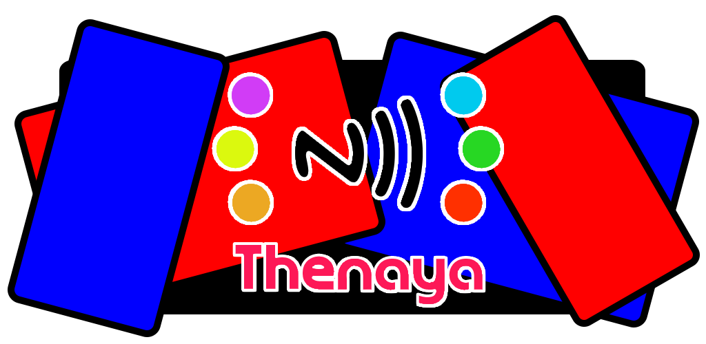

# Thenaya - TagMo for 3ds

### Restoration of this project is currently WIP. Please be patient.

## Thenaya Setup

Place "key_retail.bin" in the root of sdmc:/ folder (sdcard).    
If using separate keys, they will need to be combined first.    
 - `cat unfixed-info.bin locked-secret.bin > key_retail.bin`

## Building Thenaya

Follow the instructions at https://devkitpro.org/wiki/devkitPro_pacman to install pacman

For OSX users, add `alias pacman="sudo /opt/devkitpro/pacman/bin/./pacman"` to ~/.profile

For OSX and debian distros, replace any instances of `dkp-pacman` with `pacman`
   - See https://devkitpro.org/wiki/devkitPro_pacman#Using_Pacman

Run `sudo dkp-pacman -S 3ds-dev` to install the necessary packages.

Run `git submodule update --init --recursive` to sync amiitool submodules

for OSX users, remove `#include "portable_endian.h"` from amiitool/amiibo.c

## [Contributors](https://github.com/HiddenRamblings/Thenaya/graphs/contributors)

Additional thanks go out to (alphabetically):

### Miscellaneous
* JaySea77 - [Maintainance](https://github.com/JaySea77/Thenaya)

### Source
* Falco20019 - [libamiibo](https://github.com/Falco20019/libamiibo)
* hax0karti - [Amiibo Generator For Wumiibo](https://github.com/hax0kartik/amiibo-generator)
* N3evin - [AmiiboAPI](https://github.com/N3evin/AmiiboAPI)
* socram8888 - [amiitool](https://github.com/socram8888/amiitool)

##

###
*Thenaya is not affiliated, associated, authorized, endorsed by, or in any way connected with Nintendo. amiibo is a registered trademark of Nintendo. No official resources are included in this project. Files created with this project are not intended for sale or distribution. This project is for educational and archival purposes only.*

